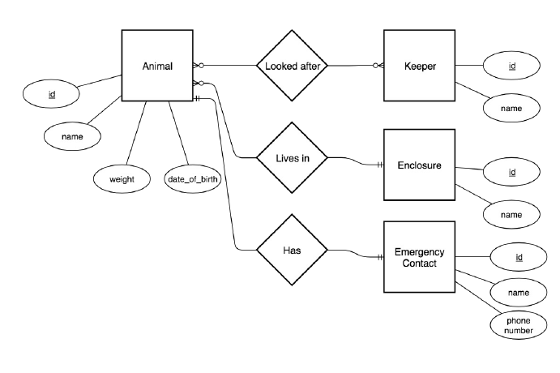

## About Laravel

### routes/web.php

- Route::get('/', function () {
  return view('welcome');
  });
- Route::get('/animals', function(){
  return "Swansea zoo has many animals";
  });
- Route::redirect(‘/here’, ’/there’);
- Route::get('/animals/{name}', function($name){
  return "Swansea zoo is home to $name and many others";
  });
- Route::get(‘/animals/{name?}', function($name = ‘Poppy’){
  return $name;
  });
- sail artisan 
- sail artisan route:list
  php artisan route:list

## models and databases

- .env file

### migrations

- sail artisan make:migration create_animals_table
  

- public function up()
     {
     Schema::create('user_zone', function (Blueprint $table) {
     //            $table->id();
     $table->primary(['user_id', 'zone_id']);
     $table->unsignedInteger('user_id');
     $table->unsignedInteger('zone_id');

// the links between user and zone
// delete a user and the links between user and zones is removed from pivot table
// delete a zone and any user linked to that doors in pivot table is removed too

            $table->foreign('user_id')->references('id')->on('users')->onDelete('cascade')->onUpdate('cascade');
            $table->foreign('zone_id')->references('id')->on('zones')->onDelete('cascade')->onUpdate('cascade');

            $table->timestamps();
        });
    }

    public function down()
    {
        Schema::dropIfExists('user_zone');
    }

- 2022_11_25_212202_create_user_zone_table.php
- Up()
- Down()
- sail artisan migrate
- sail artisan migrate:rollback
- sail artisan migrate:reset
- sail artisan make:model Animal
- note table is animals
- primary key assumed id
- sail artisan make:model Person -m
  sail artisan make:model Person --migration
- creates a migration too
  - $allAnimals = Animal::get(); will get all animals from the animals table 
  - $cat = new Animal; will create a new row 
  - $cat->save(); will save that row to our database 
  - $cat->delete(); will delete that row from the database.
- Table names: plural and _ to separate words. 
-- Examples: users, tags, animals. 
- Column names: singular and _ to separate words. 
-- Examples: id, name, weight, id, first_name. 
- Models: singular with first letter capitalized and capitalization to separate words. 
-- Examples: User, Tag, Animal, PictureFrame. 
- Controllers: singular with capitalized first letter and capitalization to separate words followed by"Controller”. 
-- Examples: UserController, TagController, PictureFrameController 
- Note: you might have controllers that do not correspond to models.
### Tinker
sail artisan tinker
- User::count();
- User::all();
-  User::first();
- User::find(1);
### Seeders
- sail artisan make:seeder AnimalsTableSeeder
-- database/seeds/AnimalsTableSeeder.php
- database/seeds/DatabaseSeeder.php
-- add $this->call(Animald=sTabSeeder::class);
- sail artisan db:seed
  - sail artisan migrate:reset 
  - sail artisan migrate 
  - sail artisan db:seed
### Model Factories
- sail artisan make:factory AnimalFactory -m Animal
  - database/factories/AnimalFactory.php
  - public function definition()
    {
    return [
    'name'=>fake()->name,
    'weight'=>fake()->randomFloat(2,150,500),
    }
 - public function run()
   {
   $a = new Animal();
   $a->name = ”Penny";
   $a->weight = 4.2;
   $a->save();
   Animal::factory()->count(50)->create();
   }
 - sail artisan migrate:fresh --seed
 - https://laravel.com/docs/9.x/helpers
 - 
### DATABASE
- $user = DB::table(‘users’)->where(‘name’,’John’)->first();
- Animal::get() or Animal::all()
  - The main difference between get() and all() is that get returns a fluent query builder
    so you can continue to build a query with it…the all() does not.
  - Recommend using get() and pretending all() doesn’t exist - your
    choice!
### Relationships
- • Migrations – create and manipulate tables.
-  • Models – each instance represents a record in the database.
-  • Seeds – populates the database with sample/test data.
-  • Model Factories – creates real looking models for testing.
### Database Relationships
- https://laravel.com/docs/eloquent-relationships
- One to One
- One to Many
- Many to Many

### One to One
- sail artisan make:migration create_emergency_contacts_table
- sail artisan make:model EmergencyContact

- update model
  - public function emergencyContact(){
  return $this->hasOne(EmergencyContact::class);
  }
- inverse relationship
  - public function animal(){
    return $this->belongsTo(Animal::class);
    }
- sail artisan make:seeder EmergencyContactsTableSeeder
  - public function run()
    {
    $e = new EmergencyContact();
    $e->name = “Beth";
    $e->phone_number = "07777 777999";
    $e->animal_id = 1;
    $e->save();
    }
  - and animal seeder must be run before emergency contact
  - because of foreign key must match primary key it refers to
  - table needs to exist first
  ### One To Many
- We want to capture that each animal lives in an enclosure. This will result in enclosures
  having multiple animals living in them.
  To do this we:
  - Attach the enclosure id of the enclosure to the animal record in the database. 
  - • Create methods in the models that return relationships.

- Notice that this is the other way round than for One-to-One relationships.
- what it is saying that an Animal lives in an enclosure
- and enclosure can contain many animals
- Animals table
  - public function up()
    {
    Schema::create('animals', function (Blueprint $table) {
    $table->id();
    $table->string('name');
    $table->double('weight',8,2);
    $table->dateTime('date_of_birth')->nullable();
    $table->unsignedBigInteger('enclosure_id’);
    $table->timestamps();
    $table->foreign('enclosure_id')->references('id')->on('enclosures')
    ->onDelete('cascade')->onUpdate('cascade');
    });
    }

-   sail artisan make:migration create_enclosures_table
  - class CreateEnclosuresTable extends Migration
    {
    public function up()
  {
  Schema::create('enclosures', function (Blueprint $table) {
  $table->id();
  $table->string('name');
  $table->timestamps();
  });
  }
- sail artisan make:model Enclosure
- class Enclosure extends Model
  {
  use HasFactory;
  public function animals(){
  return $this->hasMany(Animal::class);
  }
  }
- Set up the inverse relationship in Animal so that we can get the enclosure of a particular
  animal
- class Animal extends Model
  {
  use HasFactory;
  public function emergencyContact(){
  return $this->hasOne(EmergencyContact::class);
  }
  public function enclosure(){
  return $this->belongsTo(Enclosure::class);
  }
  }
- sail artisan make:seeder EnclosuresTableSeeder
  - class EnclosuresTableSeeder extends Seeder
    {
   public function run()
  {
  $e = new Enclosure();
  $e->name="Central Enclosure";
  $e->save();
  }
  }
  - Animal Seeder
- public function run()
  {
  $a = new Animal();
  $a->name = ”Penny";
  $a->weight = 4.2;
  $a->enclosure_id = 1;
  $a->save();
  Animal::factory()->count(50)->create();
  }
- AnimalFactory
  - public function definition()
    {
    return [
    'name'=>fake()->name,
    'weight'=>fake()->randomFloat(2,150,500),
    'enclosure_id' => 1,
    ];
    }
- class DatabaseSeeder extends Seeder
  {
   public function run()
  {
  // \App\Models\User::factory(10)->create();
  $this->call(EnclosuresTableSeeder::class);
  $this->call(AnimalsTableSeeder::class);
  $this->call(EmergencyContactsTableSeeder::class);
  }
  }
- Enclosures seeder first because Animals
- refers to enclosure id
- sail artisan migrate:reset
-`sail artisan migrate:refresh --seed
- do same with migrations
- https://laravel.com/docs/eloquent-relationships
- Animal::find(1)->enlosure; 
- When accessing Eloquent relationships as properties the relationship data is not
  actually loaded until you first access the property – lazy loading.
- Eloquent can “eager load” relationships at the time you query the parent model.
- $books = App\Book::all();
  - Lazy loads 1 qury to get all books
- foreach($books as $book) {
  echo $book->author->name;
  }
  - then another to query each book (N+1 queries N books)
- $books = App\Book:: with(‘author’)->get();
- foreach($books as $book) {
  echo $book->author->name;
  }
- just 2 queries
### Many To Many Relationships

